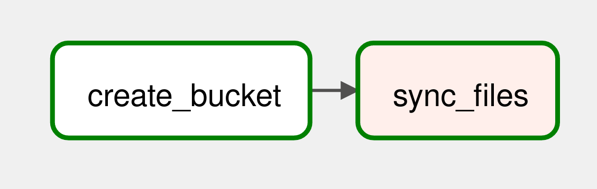

# localstack project

## DAGs

load to s3 all updated files [dag](dags/load_to_s3_dag.py)

load file to s3 and calculate metrics in spark [dag](dags/load_to_s3_departure_return_dag.py)

[spark job](spark_jobs/helsinki_bikes_metrics.py)

## AWS

main configuration [script](aws/init_aws.sh)

[lambda](aws/on_upload_metrics.py) triggered when spark job creates metrics folder and rewrites results file as single
file without parent folder

[lambda](aws/s3_to_dynamodb.py) triggered by SQS event checks if raw data and metrics files both are present in s3 and
loads data to dynamodb additionally calculating daily metrics

## Superset

*(I've created dashboard with PostgreSQL connection because AWS host and port are hardcoded and configuration allows
only to change region)*

