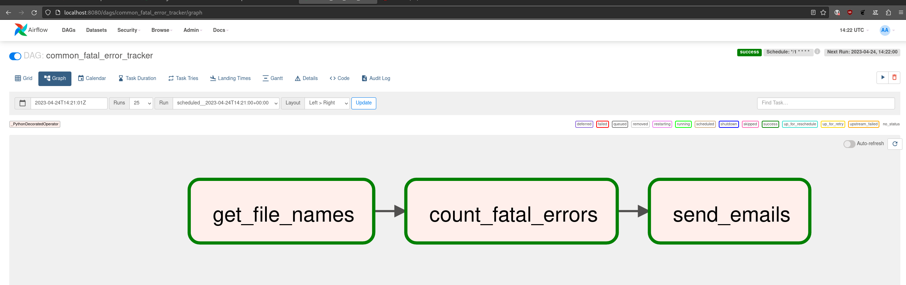

# Alert app

## Option one: spark + kafka

*(all configurations are not for prod usage)*

Better approach for continuos processing.

Will not work just by `docker compose up` because you'll need to start spark jobs.
Also for real use with `cluster` mode need to setup spark not in `standalone` mode at least, use real mail service and prod configurations of all services.

Also the better solution is to use RabbitMQ as event queue. Because this makes easer to parallelize email sending between multiple instances of email sender service. RabbitMQ tracks events separately so in case event N fails to send notification and event N+1 succeeds we just should not make acknowledgment for the event N and RabbitMQ will process it on another instance.

P.S. Just wanted to try spark streaming and get some understanding of kafka

## Option two: use log monitoring tools like `Grafana`

*(description is far out of scope for the task)*

## Option three: AirFlow

*(just to satisfy `pandas` requirement)*

Assuming log files come approximately the same time log created. File should not change.
For each aggregation use separate task. Task runs in t - t+t' period and counts errors in files with modification date from the period.
Then sends emails for each period that has more errors then limit specified.

This approach has issue in case:

`error_limit` = 10

|period one start ----------------- 5 errors --- period one end|period two start---6 errors ------------- period two end|

So in periods one and two we have less errors than limit. But if we count errors from middle of first to middle of second period we should send error notification.

Docker instructions [here](https://airflow.apache.org/docs/apache-airflow/stable/howto/docker-compose/index.html)

```bash
mkdir -p ./dags ./logs ./plugins
echo -e "AIRFLOW_UID=$(id -u)" > .env
docker compose up airflow-init
docker compose up
```





### 3.1

One possible solution is to store period counters in database and increment period counters on each run. And then send notifications with separate task. 

This is very inflexible solution at first because we need to create separate counters for each aggregation.

### 3.2

One more way is just to load all logs to database and aggregate the way wee need but there is no place for `pandas`.

## Option four: custom service

*(the worst solution)*

In short: we need to reinvent spark.

Requirements:

1. File changes tracking system
2. How much historical data/how long we should store in memory (OOM exceptions)
3. Synchronization between multiple instances
4. Integration with other services

And I think there is more. That's the problems I've found in less than 10 minutes.
